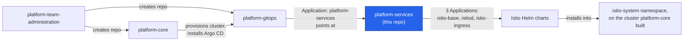
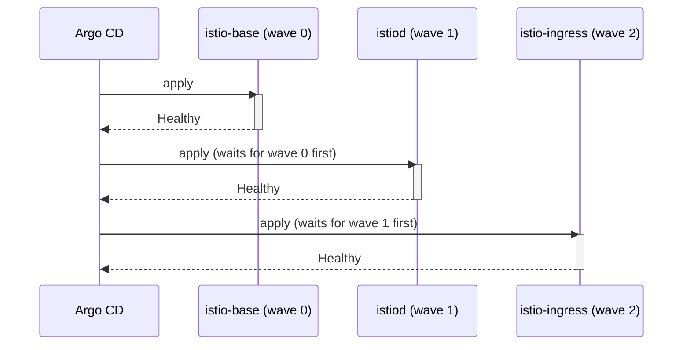
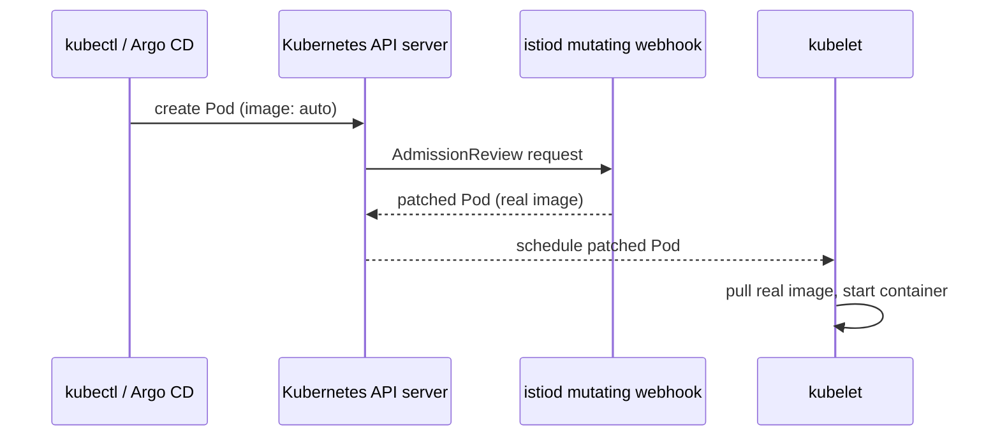

# Architecture and design choices

## What this repo is, what it does, and how it fits

`platform-services` is where this project's GitOps chain stops pointing at
more files and starts actually installing something onto a real cluster.
Every repo before it in the chain — `platform-team-administration`,
`platform-core`, `platform-gitops` — exists to get to this point: a
working cluster, with Argo CD watching a coordination repo, that eventually
resolves to real Helm charts running real pods.



Concretely, this repo does three things:

1. Declares which Helm charts (or other CRD-based extensions) should be
   installed, shared across every environment, in `environments/base/`.
2. Declares which version of each chart each environment should actually
   run, in each environment's own overlay.
3. Enforces policy on whatever gets deployed through this pipeline, via the
   Rego rules in `policy/`, and provides scripting to force an immediate
   check of the result instead of waiting on Argo CD's normal polling
   interval.

Nothing in this repo is application code. There's no Dockerfile, no
language runtime, no compiled artifact. Every file here is either
declarative YAML or a policy rule written in a declarative rule language —
the same category of file as `platform-gitops`, just one layer closer to
something that actually runs.

## Extensions vs. services: why both live in one repo

Two different categories of thing can be deployed through this repo, and
they're worth telling apart even though the mechanics of adding either are
identical:

- **Extensions** change cluster behavior without serving requests
  themselves. Istio is mostly this: CRDs, an admission webhook, a control
  plane that rewrites and manages other objects. Nothing calls Istio
  directly by address.
- **Platform services** run persistent pods with an address something else
  calls at runtime — a shared database, a message queue, an internal
  monitoring endpoint. This repo doesn't have one of these yet.

They fail differently, which is the real reason to keep the distinction in
mind rather than treating this as a purely organizational label. A broken
extension is often silent until something downstream quietly stops working
right — the `auto`-image incident below is exactly this shape: nothing
crashed loudly, a pod just sat unable to start, for a reason that had
nothing to do with any config value anyone had directly written. A broken
service, by contrast, is usually loud and immediate: whatever called it
gets a connection error right away.

Both categories are added to this repo the same way — see
[Add a new platform service or extension](../how-to/add-a-new-platform-service-or-extension.md)
— because from Argo CD's perspective they're both just Helm charts wrapped
in an `Application` object. The distinction matters for how you debug a
failure, not for how you author one.

## Why base + overlay, applied here to real workloads

`platform-gitops` uses a shared root file plus per-environment folders to
avoid repeating GitOps pointer configuration three times. This repo applies
the identical idea one layer deeper, to the actual chart definitions:
`environments/base/istio-helm.yaml` declares which charts exist and how
they're wired together (namespace, sync policy, retry behavior) — the parts
that should be identical everywhere. Each environment's own file
(`istio.yaml`) patches in only the one thing that's allowed to differ
between environments on a routine basis: the chart version.

This isn't just DRY-for-its-own-sake. It's what makes progressive rollout
possible at all. If every environment's chart definition were a full,
independent copy, bumping a version safely would require carefully copying
a large file three times and hoping nothing else drifted along the way. With
the split as it is, a version bump is a one-line change, in one small file,
that cannot accidentally touch anything else about how the chart is
installed.

## Why the chart version lives in the overlay, not in base

This deserves calling out on its own, because it's easy to assume version
pins belong in the shared base file the way defaults usually do. Here,
that's backwards on purpose.

If `environments/base/istio-helm.yaml` pinned a version directly, changing
it would change every environment simultaneously — there would be no way
to test a new version in `platform-sandbox` without also, in the same
commit, changing what `app-prod` would run the moment its own PR merged.
The whole point of separate environments collapses if the one field that
represents risk is shared across all of them.

By leaving `targetRevision` unset in `base` and setting it only in each
environment's overlay, a version bump is structurally scoped to one
environment. There's no discipline required to keep sandbox and production
from moving together — the file layout makes moving them together
impossible by default. See
[Bump the Istio version](../how-to/bump-the-istio-version.md) for the
actual mechanics.

## Why installation order is enforced with sync-waves

Istio's three pieces have a real dependency order: `istio-base` installs
CRDs and cluster-level resources nothing else can function without;
`istiod` is the control plane every other piece reports to; `istio-ingress`
is a gateway that needs `istiod` already running to attach to. Installing
them out of order — or all at once, letting Kubernetes' own scheduling
decide what starts first — risks the gateway coming up before it has
anything to register with.

Argo CD's `sync-wave` annotation solves this without needing a separate
dependency-graph object. Resources are grouped by their wave number, and
Argo CD applies one wave, waits for everything in it to report healthy,
then moves to the next:



This is the Argo CD equivalent of a dependency graph expressed entirely
through metadata on the objects themselves, rather than a separate resource
declaring "X depends on Y." Compare this to Flux, where the same problem is
solved with an explicit `dependsOn` field on a `Kustomization` object — a
more explicit mechanism, but one more kind of object to define and keep in
sync with the resources it references. Sync-waves keep the dependency
information sitting directly on the thing that has the dependency.

## Why this repo has a CI/CD pipeline even though it deploys nothing itself

`platform-gitops` deliberately has no CI/CD pipeline, on the reasoning that
a Kustomize build either renders or fails loudly, and Argo CD itself is the
continuous verification loop once a change merges. This repo looks similar
on the surface — it's also pure declarative config, also watched by Argo CD
— but it has a full pipeline anyway. The difference is what could go wrong
silently if it didn't.

A broken `platform-gitops` file fails immediately and obviously: Kustomize
can't render it, and nothing gets applied. A broken change here can render
just fine and still be wrong in a way nothing catches automatically —
pinning a chart to a version that doesn't exist, misconfiguring a sync-wave
so components race, or introducing a policy violation that would have been
rejected if anyone had actually checked before merging. Static YAML
correctness (does it parse) is a much weaker guarantee here than it is in
`platform-gitops`, because a valid `Application` object can still describe
an install that fails once Argo CD actually tries to reconcile it against a
real Helm chart.

The pipeline splits into two workflows for exactly that reason:

- **Pre-merge** (`validate-manifests`) — runs on every push except to
  `main`, on plain Docker with no cluster access. Renders every
  environment's Kustomize output and runs policy checks against it. This
  catches YAML and policy problems before they can merge, cheaply and
  quickly.
- **Post-merge** (`reconcile-and-smoke-test`) — runs only on `main`, on the
  self-hosted runner with real cluster access. Forces Argo CD to reconcile
  immediately instead of waiting on its normal polling interval, waits for
  every affected `Application` to report healthy, then runs a real smoke
  test through the gateway.

The post-merge half exists because pre-merge validation, however thorough,
can't prove a chart actually installs correctly against a real cluster —
only that the YAML describing it is well-formed and passes policy. Forcing
an immediate reconcile-and-verify after merge, rather than trusting Argo
CD's own multi-minute polling interval to eventually surface a problem, is
a direct application of a Site Reliability Engineering idea: manual,
repetitive verification work that doesn't get any easier no matter how many
times someone does it by hand is toil, and toil that can be scripted should
be. Watching a dashboard until a sync finishes, then separately checking by
hand whether the result actually works, is precisely that kind of task —
see [`scripts/argocd_reconcile.sh`](../../scripts/argocd_reconcile.sh) and
[the CI/CD pipeline reference](../reference/cicd-pipeline.md) for the exact
mechanics.

## Why a passing policy check here doesn't mean what it looks like it means

This is the single most important thing to understand before trusting this
repo's policy checks for anything real, and it's subtle enough to be worth
walking through carefully rather than stating as a one-line caveat.

Both `policy/deny-latest-tag.rego` and `policy/deny-unauthorized-namespace.rego`
guard on `input.kind == "Deployment"`. That's a completely reasonable thing
to write a policy rule against — Deployments are where an image tag or a
namespace actually shows up. The problem isn't the rule. It's what the CI
pipeline actually hands the rule to evaluate.

`validate-manifests` runs `conftest` against `kubectl kustomize`'s output
for this repo. This repo's Kustomize output is never a `Deployment` — it's
always an Argo `Application` object, because that's genuinely all this
repo's own files describe. The real `Deployment` objects Istio's charts
eventually produce don't exist yet at the point this check runs; they only
come into being later, inside the cluster, after Argo CD renders the Helm
chart the `Application` object points at. By the time a real `Deployment`
exists, this pipeline has already finished running and reported success.

So a passing `conftest test` result in this pipeline can mean either of two
very different things: "we checked, and it complies," or "we checked, and
there was nothing here of the kind this rule even looks at." Right now,
for every policy run this pipeline has ever done, it's the second one. The
rules aren't wrong and they aren't disabled — they're just never given
anything they're written to catch.

```console
$ kubectl kustomize environments/platform-sandbox > /tmp/sandbox.yaml
$ conftest test -p policy /tmp/sandbox.yaml
2 tests, 2 passed, 0 warnings, 0 failures, 0 exceptions
```

Compare that against running the same rules against a real, live Deployment
pulled straight from the cluster — which is closer to actually testing what
the rules were written for:

```console
$ kubectl get deploy istiod istio-ingress -n istio-system -o yaml > /tmp/real.yaml
$ conftest test -p policy /tmp/real.yaml
2 tests, 2 passed, 0 warnings, 0 failures, 0 exceptions
```

Both pass, and for legitimately different reasons — the first because the
rules found no `Deployment` to check at all, the second because they found
real Deployments and those Deployments happen to comply. Reading the first
result as proof of the second is exactly the mistake worth avoiding.
Confusing "nothing to check" with "checked and compliant" is how a
governance program built on policy-as-code quietly loses the coverage
everyone assumes it has, without anyone noticing until an actual violation
ships and the automated check that should have caught it never had a
chance to.

Actually closing this gap would mean `helm template`-ing each chart with
its real values inside the pipeline before running `conftest`, so the
policy check evaluates the same `Deployment` objects that eventually land
in the cluster — that's real future work, not something this pipeline does
today.

## Postmortem: the auto-image incident

Istio's gateway chart ships with `image: auto` as a literal placeholder
value. The intended mechanism: istiod runs a mutating admission webhook
that intercepts the moment a pod matching the gateway is created, and
rewrites that placeholder to a real proxy image before the pod is ever
scheduled — nobody has to hardcode an exact image tag by hand.



**What actually happened:** the first real install of this mesh left
`istio-ingress`'s pod stuck in `ImagePullBackOff`, trying to pull an image
literally named `auto` — meaning the webhook rewrite never happened for
that pod.

**First hypothesis:** the webhook's `namespaceSelector` only matches
namespaces carrying the label `istio.io/rev: default`, and `istio-system`
didn't have it. A fix went out adding that label via
`managedNamespaceMetadata` on all three `Application` objects, and the pod
eventually came up.

**What further investigation actually found:** the label was not the real
explanation. A different webhook rule in the same chart matched regardless
of that label, and on a later occasion the exact same pod came up cleanly
after a simple delete-and-recreate, with the label never having actually
been applied at all. The more likely real cause is a short timing window
after istiod starts up, during which it isn't yet ready to correctly
perform this specific rewrite — not a missing configuration value at all.

**What stayed, and why:** the label fix stayed in place. It's harmless, and
labeling a namespace explicitly rather than relying on unlabeled defaults
is reasonable practice regardless of whether it was ever the actual fix.
What changed is not the code, but the confidence behind the comment
explaining it — the honest version says what's known, what isn't, and
which category the original explanation falls into.

**The lesson, stated generally:** the first plausible-sounding explanation
for an incident is not automatically the correct one, and a fix that
happens to make the symptom go away is not proof the reasoning behind it
was right. Keep checking evidence against the story even after something
starts working again, and say so plainly in the code and the docs when the
evidence stops supporting the original explanation. See
[Troubleshooting](../how-to/troubleshooting.md#a-newly-installed-gateway-pod-sits-in-imagepullbackoff-pulling-auto)
for what to actually check if you hit this yourself.

## Postmortem: the smoke test that reported success on a real failure

**What actually happened:** the first version of the gateway smoke test
piped `curl`'s output into `head`:

```bash
curl -sS -H "Host: $H" --max-time 10 http://... | head -n 3
```

The CI job reported "Completed" — even on a run where the gateway had no
working route configured and every real request was failing.

**Root cause:** under `set -e`, a shell pipeline's exit status is the exit
status of its *last* command, not any command earlier in the pipe. `head`
succeeds even when it receives zero bytes of input — it just prints nothing
and exits `0`. No matter how badly `curl` failed, `head`'s own success was
the only exit code anything downstream was watching.

**The fix:** remove the pipe entirely, so there's no command left to hide
behind:

```bash
curl -sS -H "Host: $H" --max-time 10 http://... -o /tmp/resp.txt
head -n 3 /tmp/resp.txt
```

Now `curl`'s own exit code is the one `set -e` actually observes.

**The lesson, stated generally:** a test is only as trustworthy as the
exit code it actually reports on, and a pipe can silently swap which
command that exit code belongs to. This applies well beyond this one
script — anywhere `set -e` and a pipeline coexist, check which command in
the pipe is actually the one whose failure would be noticed.
