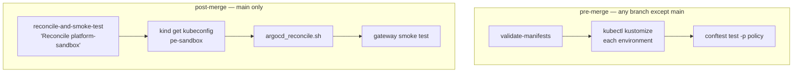

# CI/CD pipeline reference

Full reference for [`.circleci/config.yml`](../../.circleci/config.yml).

## Executor

`local-machine` — `machine: true`, `resource_class:
erikan/local_laptop_runner`. Only used by `reconcile-and-smoke-test`. The
self-hosted runner is required because reconciliation reads the target Kind
cluster's kubeconfig directly off the same physical machine hosting the
clusters — this is the same runner `platform-core`'s pipeline uses.
`validate-manifests` needs no cluster access and runs on a plain
`cimg/base:2024.01` Docker image instead.

## Jobs

### `validate-manifests`

Runs on plain Docker — no cluster, no self-hosted runner. Installs
`kubectl` and `conftest`, then for each of `platform-sandbox`, `app-dev`,
`app-prod`: renders `kubectl kustomize environments/$env`, then runs
`conftest test -p policy` against the rendered output.

### `reconcile-and-smoke-test`

| Parameter | Type | Default | Effect |
|---|---|---|---|
| `kind_cluster_name` | string | *(required)* | The Kind cluster's own name — not always the same as the environment folder (`platform-sandbox`'s cluster is `pe-sandbox`). |
| `smoke_host` | string | `platform-sandbox.local` | Passed to the smoke test as `SMOKE_HOST`. |

Steps: fetch the named cluster's kubeconfig via `kind get kubeconfig`, set
the current context's namespace to `argocd` (required for `argocd --core`
mode), then run [`scripts/argocd_reconcile.sh`](../../scripts/argocd_reconcile.sh)
with `SMOKE_HOST` set. Always cleans up the local `kubeconfig.yaml` file
afterward, even on failure (`when: always`).

## Workflows

| Workflow | Trigger | Jobs |
|---|---|---|
| `pre-merge` | Any branch push except `main` | `validate-manifests` |
| `post-merge` | Push to `main` | `reconcile-and-smoke-test`, named "Reconcile platform-sandbox", `kind_cluster_name: pe-sandbox`, `smoke_host: platform-sandbox.local` |

Only `platform-sandbox` is wired into `post-merge` today — `app-dev` and
`app-prod` don't have populated `istio.yaml` overlays yet, so there's
nothing environment-specific to reconcile there. Adding them once those
overlays exist means adding another parameterized invocation of
`reconcile-and-smoke-test` to the `post-merge` workflow, same shape as the
one already there.

## Prerequisites on the self-hosted runner

- `kubectl`, `kind`, `conftest`, and the `argocd` CLI installed
- No CircleCI context or secrets are needed for `reconcile-and-smoke-test`
  — it reads the target Kind cluster's kubeconfig directly off the runner,
  since the runner *is* the machine hosting the clusters.

## Why pre-merge never touches a real cluster, and post-merge always does

See [why this repo has a CI/CD pipeline](../explanation/architecture-and-design-choices.md#why-this-repo-has-a-cicd-pipeline-even-though-it-deploys-nothing-itself)
for the reasoning behind this specific split.
